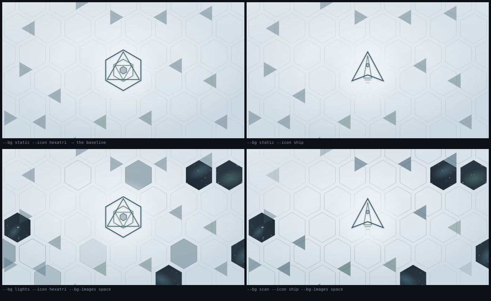
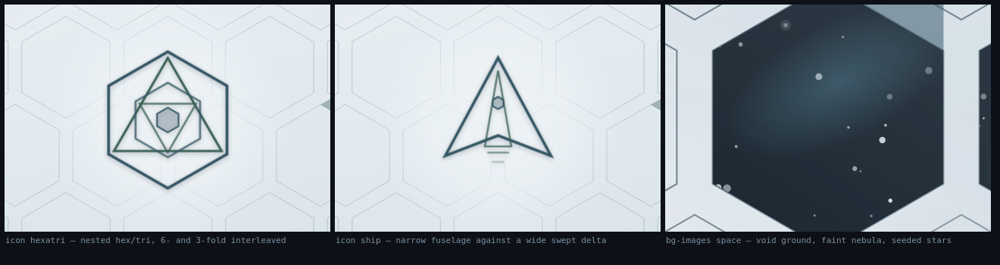

# Graphic mood

Reference for anyone — human or agent — extending the `bgsvg` crate. It records
*why* the output looks the way it does, so new features join the system instead
of arriving from a different one.

**The mood in one line:** a clinical high-altitude blueprint. Cold, high-key,
almost empty, with one thing worth looking at.

**Touchstones:** the Sky Tower in *Oblivion* (white, glazed, isolated, sunlit
from a long way up) and *Antichamber* (white void, black linework, geometry as
the subject). Not neon cyberpunk, not HUD sci-fi, not dark mode.





## The five rules

Everything below follows from these. If a change breaks one, it will look wrong
no matter how good it is on its own.

**1. Contrast is a hierarchy tool, not a texture tool.**
The lattice lives at 0.27 stroke opacity — deliberately near-invisible. Dark
values are rationed and spent almost entirely on the center icon, which is why
one focal point wins absolutely. Raising the field's contrast to make it "more
visible" destroys the whole effect.

**2. Everything is high-key except what is deliberately not.**
The canvas sits in the top 15% of the value range (`#eef3f6` → `#d9e3ea`). Only
two things are allowed to be dark: the icon strokes, and space cells. A third
dark element would flatten the hierarchy.

**3. Two desaturated hues, no warmth.**
Steel-blue and sea-green, both pulled 58% toward near-black slate. Nothing
saturated, nothing warm, no third hue. The restraint is the style.

**4. The halo subtracts, it does not glow.**
The radial gradient behind the icon paints *canvas colour* over the lattice —
it erases pattern rather than adding light. Clean room, not spotlight. Any new
"emphasis" effect should remove competing detail rather than add brightness.

**5. Motion is ambient and slow.**
24s rotations, 5s sweeps, 9s light cycles with randomised per-cell phase so only
a few cells breathe at once. Nothing pulses fast, nothing loops visibly, nothing
asks for attention. If a viewer notices the animation as an event, it is wrong.

## Palette

`src/style.rs` is the source of truth (`PAL`, `VOID`); these are its computed
values, listed so you can match them by eye without running anything.

| role | value | notes |
|------|-------|-------|
| canvas gradient | `#eef3f6` → `#d9e3ea` | top-left to bottom-right |
| `a` hexagons, ship wings | `#365665` | steel-blue, `#6fb7d1` darkened 58% |
| `b` triangles, ship ridge | `#395e53` | sea-green, `#77c9a6` darkened 58% |
| `ink` lattice strokes | `#2a424f` | at 0.27 opacity |
| `VOID` space ground | `#16212a` | deep blue-slate, **never `#000`** |
| stars | `#eef3f6` | the canvas highlight, reused |
| nebula | `#6fb7d1` / `#77c9a6` | 0.3 → 0 radial, the *undarkened* hues |

`VOID` is not black on purpose. A true black reads as a hole punched in from a
different design; keeping it in the blue-slate family makes it a window.

## Geometry

- Hexagon lattice at spacing `2s`, `s = min(w,h)/9`, so density is constant at
  every resolution.
- Triangles are sparse and follow the holder/intersector rule (see the main
  README) — few, never overlapping, never inside the icon zone.
- The icon glyphs are drawn on a 200-unit grid and scaled by `min(w,h)*0.34/200`.
  Keep new glyphs inside a radius of ~88 units so they occupy the same footprint.
- Sacred-geometry nesting is the icon language: shapes contain shapes, and
  tangency is deliberate. `hexatri` interleaves 6-fold and 3-fold symmetry.
- **Nested copies of one shape read as a chevron, not an object.** The `ship`
  glyph works because a narrow shape reads against the wide swept delta; an
  earlier version using two concentric deltas just looked like an "A". The narrow
  shape is now the folded ridge rather than a second outline (see below), but the
  rule it satisfies is unchanged.

## The cloaked ship (`icon.ship`)

The one glyph that is a *solid* rather than linework: a sheet folded along its
spine, read as four facets — lit wing, lit ridge face, shadowed ridge face,
shadowed wing. The silhouette is exactly the old one; the facets tile the hull
quad, which `icon.rs`'s `the_ship_is_a_folded_solid` checks by area so the cloak can never quietly move it.

Three constraints hold it inside the five rules. *How* each one is achieved is
argued in `ico_ship`'s docstring; what matters here is why the mood needs them:

- **Relief is value, not linework.** The interior folds carry no stroke at all —
  outlining them reads as wireframe, an object seen *through* instead of a solid
  seen *lit*. Only the silhouette keeps an outline, at its old 3.6 width.
- **One light, not four.** Every facet is lit by the same ramp, from the upper
  left, where the canvas gradient is already brightest. Light the facets
  separately and they read as loose shards instead of one folded object.
- **The cloak is the translucency.** No facet reaches `0.3`, so the halo and the
  lattice read straight through the hull. Filled, the glyph still spends less ink
  than the old double outline, so rule 1 holds — but a facet pushed opaque would
  both flatten the relief and buy the second dark mass rule 2 forbids.

The crest highlight along the spine is the only bright element, canvas colour
fading aft. On a high-key page a highlight cannot out-light the paper, so it reads
only where it lies over the shadowed ridge face: light added by *removing tint*,
the same inversion the rain's head uses. Rule 4 in a third costume.

## Space cells (`background.image STARFIELD`)

Windows onto the void, at ~8% of eligible hexagons. Sparse is the point: a few
portals, not a checkerboard. Each is a clipped void ground, one faint nebula
ellipse, and ~18 seeded stars with two bloomed anchors — drawn, never embedded,
so there are no assets and it stays crisp at 4k.

The ~8% applies to `background.motion STATIC`, `SCAN` and `LIGHTS`. Under
`background.motion CLOSEOPEN` every eligible hexagon is a window and the
blinds keep all but a few shut — same sparseness, enforced in time instead
(see below).

Two constraints exist for mood reasons, not technical ones:

- A cell must clear the icon zone **entirely** (centre distance ≥ `clear_r + s`),
  the same exclusion triangles obey.
- Under `background.motion LIGHTS` a cell pulses its **border only** (`.lightb`). The normal
  pale fill flash would wash the starfield out.

Triangles are allowed to cross a space cell. They are translucent, so they read
as shards catching light — this is intentional, not an oversight.

## Blinds (`background.motion CLOSEOPEN`)

A canvas-filled hexagon over each window, scaling about its own centre: closed at
`scale(1)`, open at `scale(0)`. It reveals from the border inward, which keeps
the static lattice edge as the constant and lets the picture grow inside it —
the opposite (shrinking the starfield) would peel the cell away from its own
outline. Rule 4 applies: the blind **subtracts** the window rather than adding a
glow to announce it.

**Sparseness moves from space to time.** Here *every* eligible hexagon is a
window — ~76 rather than ~7 — and the duty cycle does the rationing: a blind is
shut for 86% of its cycle, so about 11 windows show anything and ~3 are fully
open at once. Fewer black cells than the sparse mode, but a window can open
anywhere instead of always in the same seven places. Two consequences follow:

- The period is **60–90 s**, not the 9–24 s used elsewhere. Lowering the open
  ratio without stretching the period turns each opening into a blink, and rule 5
  forbids anything that registers as an event. Fully open lasts ~3 s; the shrink
  takes ~4 s.
- Window borders drop back to `STROKE_O`. The brighter `SPACE_STROKE_O` exists to
  mark a handful of portals; applied to every cell it is just the lattice opacity
  raised across the board, which rule 1 forbids outright.

The cost is file size: ~76 starfields instead of ~7 takes a 4k frame from ~48 KB
to ~222 KB (~35 KB gzipped). Acceptable for a wallpaper. If it ever stops being
acceptable, share a handful of starfields through `<defs>` and `<use>` before
touching the star count — the density of stars is doing real work, and halving it
was measured to buy nothing (see below).

### Windows switch themselves off while covered

SVG performs no occlusion culling: a shut, fully opaque blind does **not** stop
the starfield beneath it from being repainted every frame. So each window also
carries `class="win"`, whose `winvis` keyframes set `display:none` for exactly
the span its blind covers it. Measured on this lattice at 1080p, back to back in
software rasterisation:

| | frame rate | dropped frames | renderer RSS |
|---|---|---|---|
| always painted | 46–49 fps | 99–127 | 1142 MiB |
| off while covered | **57–59 fps** | **13–25** | **1031 MiB** |

Roughly +22% frame rate, 5–10× fewer dropped frames, ~110 MiB less resident
memory, for +6 KB of output. The cost is confined to the paint area, not the star
count — a control with half the stars ran no faster than the baseline, which is
why cutting star density is the wrong lever.

Two caveats worth keeping: this was measured under software rasterisation with no
GPU available, and on a real GPU every variant likely sits at 60 fps and the win
shrinks toward nothing; and absolute frame rates moved a lot with machine load,
so only same-batch comparisons mean anything.

**`BLIND_KF` is the single source of both keyframe sets.** The window's on/off
span is derived from the blind's, one percent wider on each side, so the stars are
already present before the blind starts to move. Hand-writing the two spans
separately is how you get a starfield popping in over a shut blind; if you retime
the blind, retime it there and both follow.

Three more things this depends on, all easy to break:

- The blind is filled with `url(#bg)`, and `#bg` is `gradientUnits="userSpaceOnUse"`
  for exactly that reason. Revert it to the default `objectBoundingBox` and each
  blind squeezes the whole canvas ramp into one hexagon, so a *closed* cell shows
  as a faint patch instead of disappearing.
- The blind sits **above its window, below the triangles**. A triangle crossing a
  window must stay put while the blind moves under it.
- `.blind` rests at `scale(0)` and `.win` at `display:inline` — both **open** — and
  the keyframes override them while running. Rest either one closed and
  `prefers-reduced-motion` hides the starfield completely: motion off should cost
  the motion, never the picture.


## Character rain (`overlay.matrix`)

Columns of characters at `overlay.matrix.angle` (0–360, `0` = downward, increasing
clockwise) in `overlay.matrix.color` (`#rrggbb` or `#rrggbbaa`).

**The characters do not move.** Every cell of a column holds one glyph, chosen once
at generation and fixed for good; what travels is the *lighting*. A head flares at
one cell, steps down, and fades out over the next ~26% of the column, and each cell
runs that same life one cell-time later than the one above it — so the head keeps
advancing into a fresh character while the ones behind dim in place. Translating the
glyphs instead reads completely differently: rigid words sliding across the canvas,
which is what this is not.

**"Brighter" is inverted here, deliberately.** The canvas is high-key, so on it a
*more opaque* glyph is the loud one. The head is therefore the darkest character and
the trail dissolves into the page — the opposite of the film, and the only reading
that obeys rules 1 and 2. `MATRIX_HEAD_STEP` puts a visible step between the head and
the cell behind it; without it the falloff alone is ~4% over one cell and the head
reads as just another glyph.

Three more constraints, all mood rather than technical:

- The default colour is `#395e53b3` — `PAL['b']`, the existing sea-green, at 0.70.
  **The default stays inside rule 3**; a caller who passes a saturated third hue is
  overriding the mood on purpose, which is their call and is not enforced against.
- A head takes **18–34 s** to walk its column, not the second or two the film uses,
  and only ~34% of column slots carry one. Rule 5 has no exception for a recognisable
  effect — and with the lighting travelling rather than the glyphs, a fast head reads
  as flicker rather than as rain.
- The rain is drawn **under the halo**, so the halo erases it around the icon the same
  way it erases the lattice. Rule 4 again: the focal point is protected by
  subtraction, and the layer needs no icon-exclusion logic of its own.

ASCII only (digits, capitals, a handful of symbols). Katakana is the canonical look,
but no font can be embedded without breaking the self-contained rule, so on a machine
with no CJK font the whole layer would be tofu. The set also omits `< > & " '`, so a
glyph never needs escaping.

Each glyph's `fill-opacity` attribute carries the value its keyframes give it at
`t=0`, and a presentation attribute loses to a running animation — so
`prefers-reduced-motion` freezes the true opening frame rather than some other state.
Same rule the blinds follow: motion off costs the motion, never the picture.

## Extending

**Do:** reuse `PAL`; keep new strokes thin and uniform; make new motion slower
than you think it should be; add darkness only by *removing* light; put new
detail near the center or not at all.

**Don't:** add a third hue; add warmth; raise the lattice opacity; add fast or
looping-visible animation; embed raster assets; use pure black or pure white;
add a second focal point.

## Regenerating

```sh
for f in docs/mood/samples/*.json; do target/release/bgsvg "$f"; done
```

The `.svg` files in `samples/` are the live artifacts — open them in a browser to
see the animation, which the PNGs cannot show. The PNGs exist so the mood is
inspectable without running anything.
